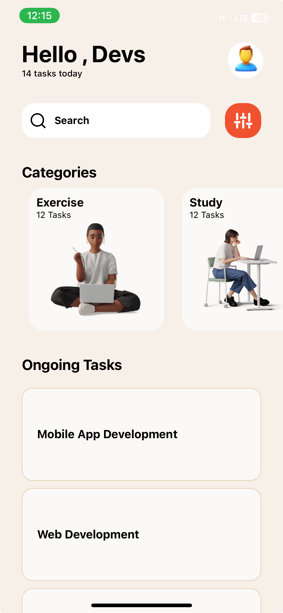

# rn-assignment3-11181591

## Description
This project is a task management application built with React Native. It includes categories and tasks, styled to match the provided UI design.

## Components
- *App.js*: The main component containing the overall structure.
- *TaskCategory.js*: Renders a task category with an icon.
- *TaskItem.js*: Renders an individual task item.

## Screenshots
